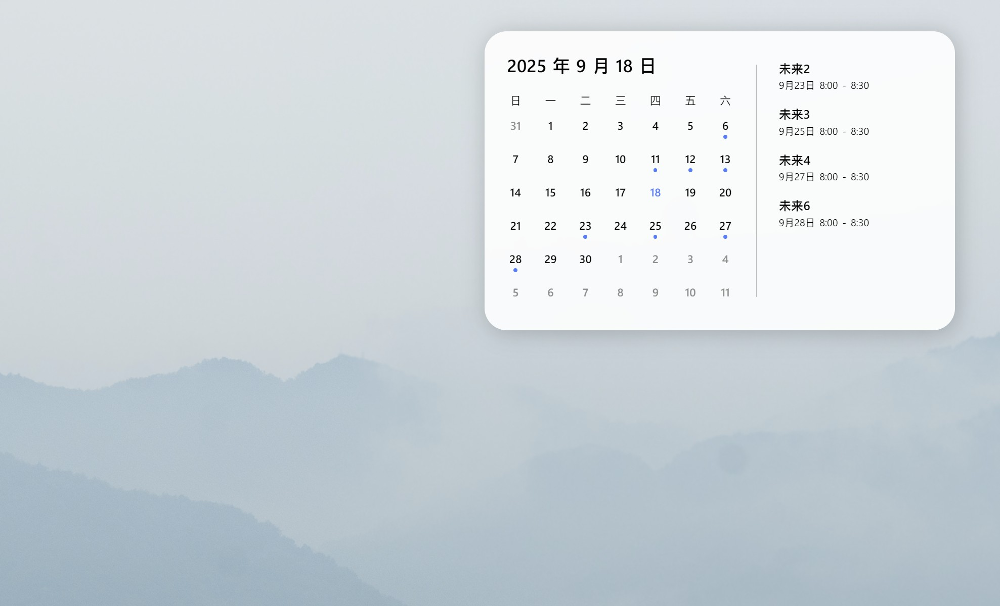

# 小鱼日历🐟

小鱼日历是一个简单的桌面日历程序，支持从Outlook邮箱中同步日程并显示在桌面上。我们提供了一个后台同步程序和一个作为桌面的网页，若想将网页应用到桌面，则可能需要到商业软件**Wallpaper Engine**。

</img>

桌面日历的大小，位置与背景图片可以自定义设置。

## 安装

可以从[此处](https://github.com/syido/fish_calendar/releases)下载使用`pyinstaller`打包的可执行文件，桌面网页可以从[Steam创意工坊](https://steamcommunity.com/sharedfiles/filedetails/?id=3570729148)订阅。

### 修改程序
亦可以下载源代码进行编辑，在运行前，先从[Microsoft Entra](https://entra.microsoft.com/)中注册应用，并获得ID和KEY，并以如下方式填写在`src/app_key.py`中

``` python
class AppKey:
    CLIENT_ID = "应用的ID"
    CLIENT_SECRET = "应用的KEY"
```

若需要打包程序，可运行以下命令：

```ps
pyinstaller main.py --version-file version.txt -- name "FishCalendar" --noconsole --icon="assets/icon.ico" --add-data "assets;assets"
```

或用其他方式重新打包。


## 使用

运行程序，点击连接，通过Outlook登录即可同步日程。在Wallpaper Engine中订阅并启用壁纸，即可将日程展示在桌面上。

右键任务栏图标，可将程序设置开机启动（记得将程序的文件夹放在一个合适的的，不会经常移动的位置）。若没有开机启动，请检查任务管理器/启动应用的相关设置。

> [!NOTE]
> 程序还没支持多账号，若想要更换账号，请在任务栏图标选择`打开缓存路径`手动删除其中文件再重新启动程序。


## 许可证与致谢

本项目的源代码遵循 [MIT](LICENSE) 协议。

本项目包含以下[第三方依赖](docs/LICENSES.md)，它们遵循各自的开源许可证，并不受本项目许可证限制，请在使用时遵守这些依赖的原始许可证。
